# Detailed TREC DL Results

[Back to the repository overview](../README.md)

This page preserves the existing appendix result tables for Whole-Pool Setwise re-ranking, exported on **2026-09-29**. The 14 images are 600 dpi crops of the source PDF, including the original captions. **Table numbers 4–17 are retained for provenance.** Click any table to open its full-resolution PNG.

The snapshot covers TREC DL19/DL20 effectiveness, inference costs, repeatability, and input-order controls. It excludes later revision-baseline and BEIR results. Reported values and statistical annotations are reproduced as shown in the source snapshot; this export does not recalculate them. The [export manifest](assets/appendix-tables/manifest.json) records the source PDF hash, table labels, source pages, and crop coordinates.

## Contents

- [Aggregate effectiveness summaries](#aggregate-effectiveness-summaries): Tables 4–5.
- [Per-model results across all pools](#per-model-results-across-all-pools): Tables 6–14, with model navigation below.
- [Cost and diagnostic controls](#cost-and-diagnostic-controls): Tables 15–17.

## Reading the tables

The main DL matrix covers nine models, seven methods, two datasets, and candidate pools of **10, 20, 30, 40, 50, and 100 passages**. See the [method abbreviations](../README.md#methods) for the SW-* and WP-* variants.

- **nDCG@10** measures the first ten ranks; **nDCG@N** measures the ranking through the current candidate-pool size, N. An average of nDCG@N across the pool-size sweep is not a pool-100 result.
- **Output objectives differ:** the original windowed SW-* settings target the top-10 prefix, while WP-* settings construct the complete pool ranking. Interpret token and runtime comparisons with that distinction in mind.
- **P10** in Tables 6–14 reports nDCG@10. **P20–P100** report `nDCG@10 | nDCG@N`. Their **Avg. Calls/q** column averages serial inference calls across both datasets and all six pool sizes.
- The **↑ / ↓** annotations in Tables 6–14 mark results significantly higher/lower than WP-DE for the same dataset, pool, and metric. The original captions specify two-sided paired approximate-randomization tests with 10,000 samples and Bonferroni correction across the displayed WP-DE comparisons in each table, at α = 0.05.

## Aggregate effectiveness summaries

### Table 4: Pool-size summary

Mean effectiveness over DL19/DL20, all nine models, and the pool-size sweep. The difference column is the method's mean nDCG@10 minus WP-DE's; the robustness rank orders methods by mean nDCG@10.

[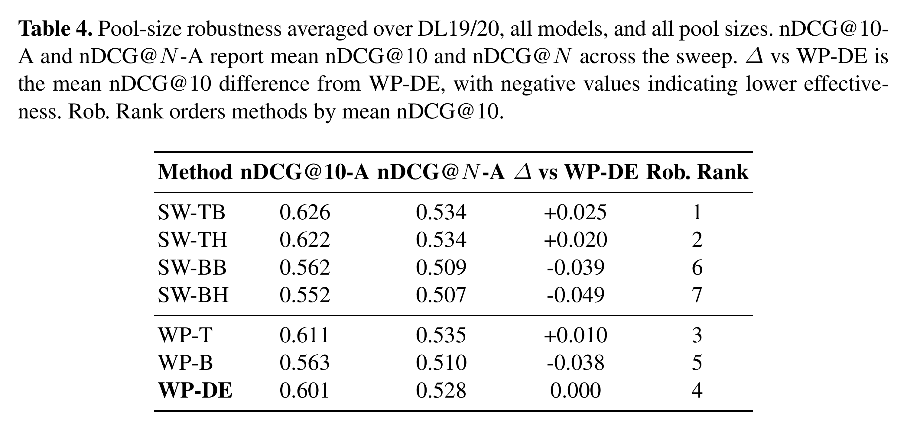](assets/appendix-tables/table-04-pool-size-summary.png)

### Table 5: Paired non-inferiority summary

The reported differences are **WP-DE minus the comparator**, pooled across models, datasets, pool sizes, and metric depths. The non-inferiority margin is δ = 0.01; “% Better” is the share of positive WP-DE differences. “Best SW-*” and “best non-DE” select the strongest comparator within each comparison. These percentages summarize that collection of comparisons, rather than a single model or a single pool size.

[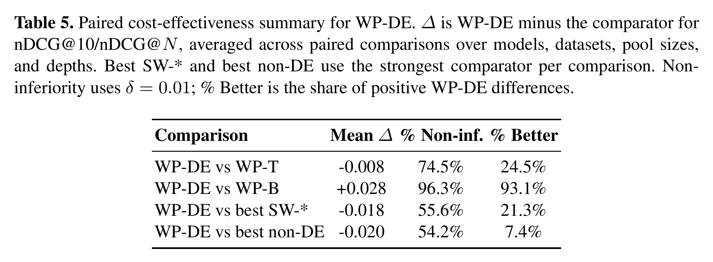](assets/appendix-tables/table-05-noninferiority-summary.png)

## Per-model results across all pools

Each table contains all seven methods on DL19 and DL20, with the same six candidate-pool sizes. Use the model links to jump directly to a table.

| Family | Models |
| --- | --- |
| Qwen3.5 | [0.8B](#table-6-qwen35-08b) · [2B](#table-7-qwen35-2b) · [4B](#table-8-qwen35-4b) · [9B](#table-9-qwen35-9b) · [27B](#table-10-qwen35-27b) |
| Llama3.1 | [8B](#table-11-llama31-8b) |
| Ministral 3 | [3B](#table-12-ministral-3-3b) · [8B](#table-13-ministral-3-8b) · [14B](#table-14-ministral-3-14b) |

### Table 6: Qwen3.5-0.8B

[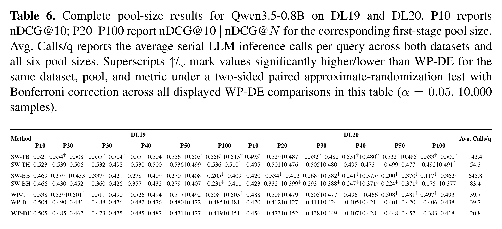](assets/appendix-tables/table-06-qwen3-5-0-8b.png)

### Table 7: Qwen3.5-2B

[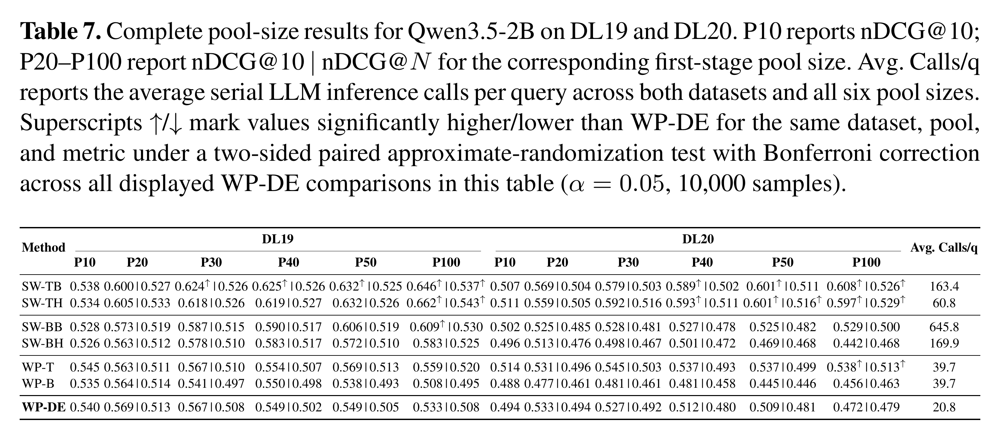](assets/appendix-tables/table-07-qwen3-5-2b.png)

### Table 8: Qwen3.5-4B

[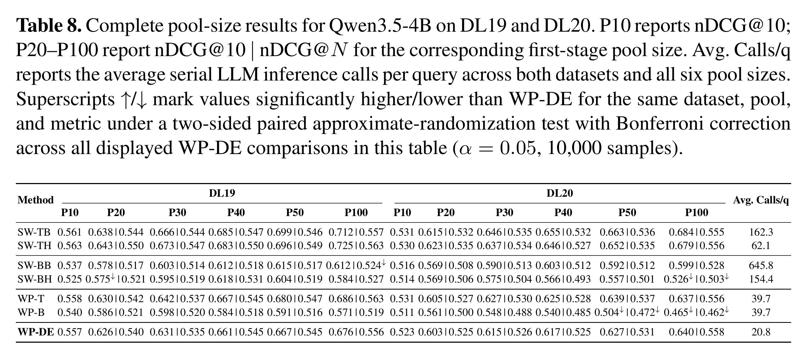](assets/appendix-tables/table-08-qwen3-5-4b.png)

### Table 9: Qwen3.5-9B

[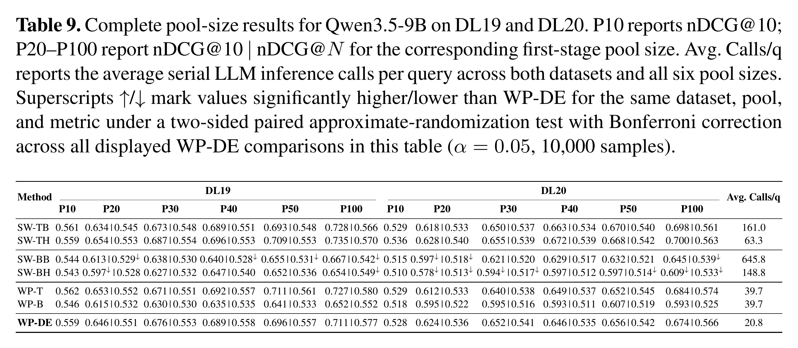](assets/appendix-tables/table-09-qwen3-5-9b.png)

### Table 10: Qwen3.5-27B

[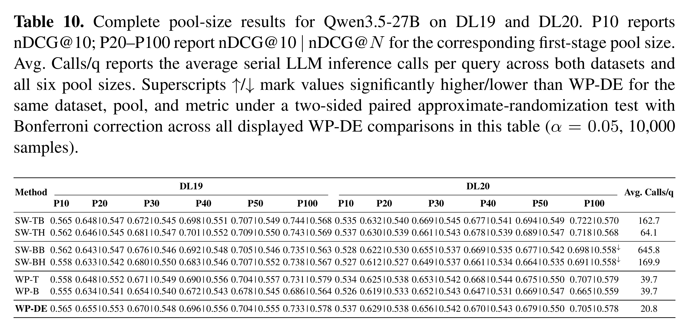](assets/appendix-tables/table-10-qwen3-5-27b.png)

### Table 11: Llama3.1-8B

Checkpoint: `meta-llama/Meta-Llama-3.1-8B-Instruct`.

[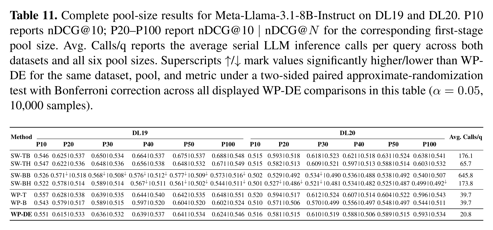](assets/appendix-tables/table-11-llama3-1-8b.png)

### Table 12: Ministral 3-3B

Checkpoint: `mistralai/Ministral-3-3B-Instruct-2512`.

[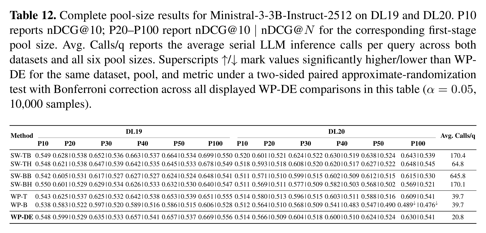](assets/appendix-tables/table-12-ministral3-3b.png)

### Table 13: Ministral 3-8B

Checkpoint: `mistralai/Ministral-3-8B-Instruct-2512`.

[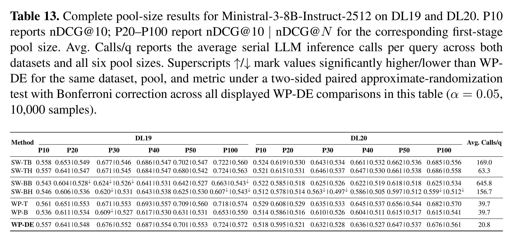](assets/appendix-tables/table-13-ministral3-8b.png)

### Table 14: Ministral 3-14B

Checkpoint: `mistralai/Ministral-3-14B-Instruct-2512`.

[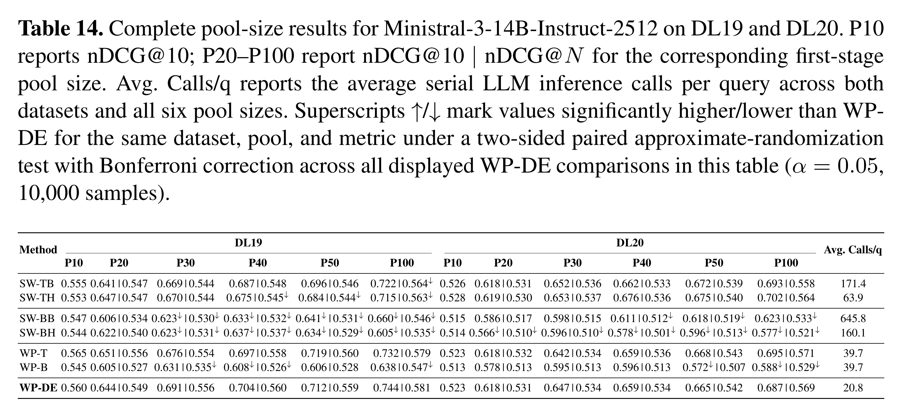](assets/appendix-tables/table-14-ministral3-14b.png)

## Cost and diagnostic controls

### Table 15: Cost and parser diagnostics

Pool-100 per-query log summaries, averaged across DL19, DL20, and all nine models. Token columns are in thousands; runtime is seconds per query. **Parse Fallback/q** counts parser fallback events, while **Unparseable/q** counts fallback events after retries are exhausted.

[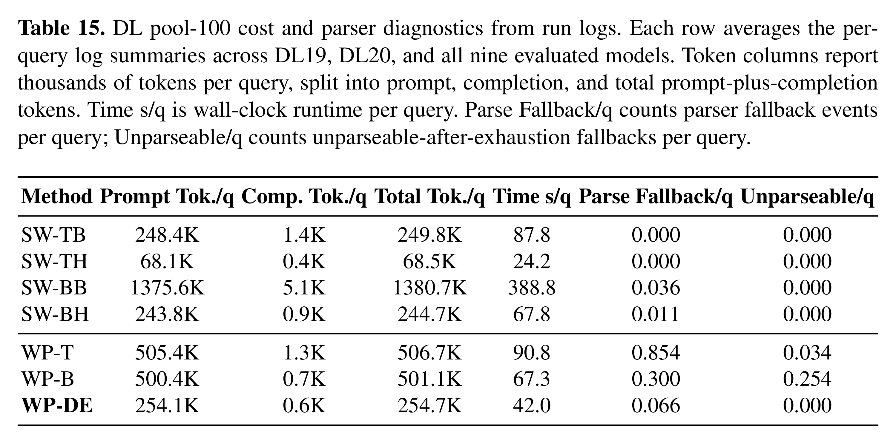](assets/appendix-tables/table-15-cost-parser-diagnostics.png)

### Table 16: Repeatability

Five repeated DL19 pool-100 runs for each of three representative models and the three whole-pool methods. The secondary metric is **nDCG@50**, because these stability runs recorded cutoffs through 50. Fallback percentage is measured over LLM comparisons. This checks repeatability under the fixed experimental setup; prompt and order variations are separate controls.

[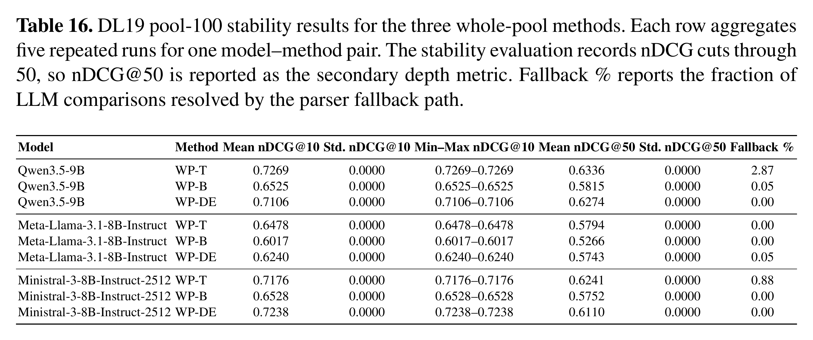](assets/appendix-tables/table-16-repeatability.png)

### Table 17: Position bias

DL19 pool-100 results for canonical BM25 order, reversed order, and a fixed-seed shuffle, using the same three models and whole-pool methods. Differences are each control's nDCG@10 minus its forward-order score. The asterisk marks a significant paired forward-control difference under the original caption's test, with Bonferroni correction across 18 comparisons at α = 0.05.

[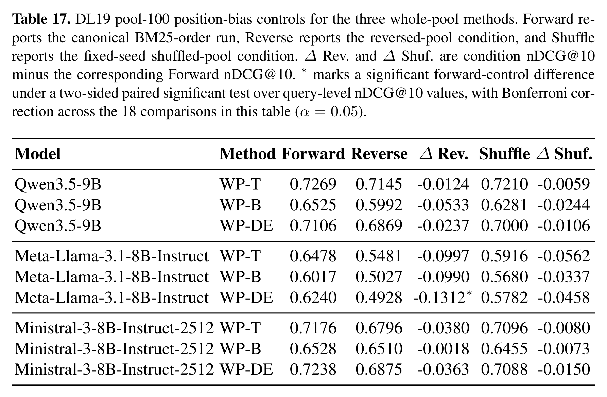](assets/appendix-tables/table-17-position-bias.png)

[Back to contents](#contents) · [Repository overview](../README.md)
